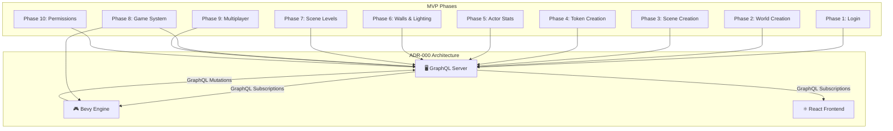

# ADR-000 and MVP Roadmap Analysis

This document analyzes the relationship between the architecture defined in [ADR-000](./adrs/20260501-000-durable_objects_with_graphql_event_driven_sync.md) and the MVP roadmap.

## High-Level Alignment

The architecture described in ADR-000, which is based on a three-tier structure (Bevy engine, React frontend, Rust/Axum GraphQL server) and an event-driven synchronization model, provides a robust foundation for implementing all phases of the MVP.

The core principle of using GraphQL mutations for actions and GraphQL subscriptions for state synchronization is a perfect fit for the real-time, multiplayer nature of the application.

### Mermaid Diagram: MVP Implementation on ADR-000 Architecture

## Detailed Breakdown by MVP Phase

*   **Phase 1 (Login):** User authentication will be handled by a GraphQL mutation to the server, which will issue a session token. This is a standard and secure approach that fits well within the defined architecture.

*   **Phase 2-7 (World, Scene, Token, Actor, Walls, Levels):** All of these phases involve the creation, modification, and deletion of game objects. Each of these actions will be implemented as a GraphQL mutation (e.g., `createWorld`, `moveToken`, `addWall`). The server will validate these mutations, persist the changes to the PostgreSQL database, and then broadcast a `WorldEvent` to all connected clients via a GraphQL subscription. The Bevy engine and React frontend will listen for these events and update their local state accordingly, ensuring a consistent view of the game world for all players.

*   **Phase 8 (Game System Integration):** The Bevy engine will be responsible for implementing the game's rules and logic. When a player performs an action that is governed by the game system (e.g., moving a token, rolling dice), the Bevy engine will first perform a client-side prediction to provide immediate feedback to the user. It will then send a GraphQL mutation to the server for validation. The server will act as the single source of truth, ensuring that all actions comply with the game's rules.

*   **Phase 9 (Multiplayer):** The event-driven architecture is the cornerstone of the multiplayer experience. When one player performs an action, the resulting `WorldEvent` is broadcast to all other players in near real-time, keeping everyone's game state synchronized. The invitation system will be implemented with its own set of GraphQL mutations and database tables.

*   **Phase 10 (Permissions Model):** The permissions model will be enforced on the server. Before executing any GraphQL mutation, the server will verify that the user has the necessary permissions to perform that action. This will be based on the user's role (e.g., player, DM) and the policies defined for that role.

## Key Architectural Decisions from ADR-000

The ADR makes several key decisions that will be critical for the success of the MVP:

*   **Core Models:** The use of a shared set of "core models" will ensure data consistency across the different tiers of the application.
*   **Adapter Layer:** The adapter layer between the Diesel models and the core models is a good design practice that will keep the database-specific implementation details isolated.
*   **Delta Versioning:** The `migrateData` pattern is a crucial feature for ensuring long-term data compatibility as the application's schema evolves.
*   **Network Optimization:** The `prepareDerivedData` pattern will help to minimize network traffic and improve the application's performance.
*   **Fallback Transports:** The plan for fallback transports will make the application more resilient and accessible to a wider range of users.

## Conclusion

The architecture outlined in ADR-000 is a comprehensive and well-thought-out plan that is well-suited for building the ThunderForgeVTT MVP. It provides a clear path forward for implementing all the required features and addresses the key technical challenges of building a real-time, multiplayer application.
