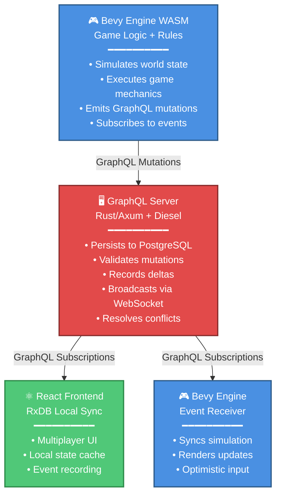
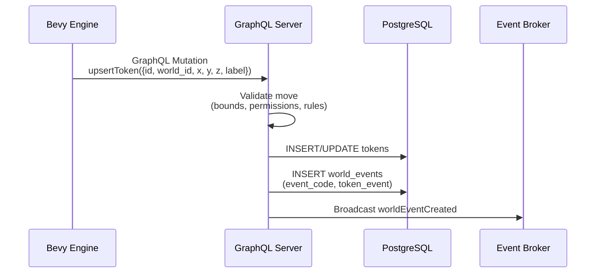
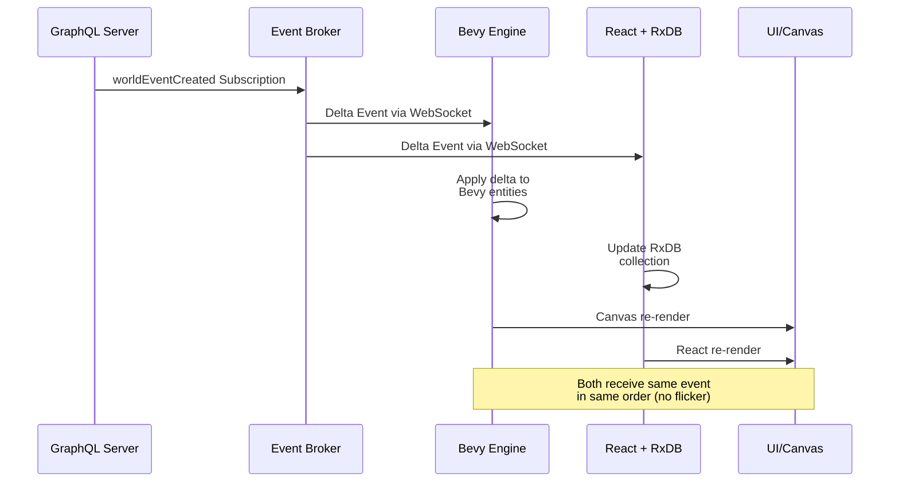

# ADR-000: Durable Objects via GraphQL Event-Driven Synchronization Architecture

**Status:** Accepted

**Decision Date:** 2026-05-01

## Context

ThunderForgeVTT is a multiplayer virtual tabletop system with three architectural tiers:

1. **Bevy Game Engine** (WASM) - Handles all game logic, canvas rendering, and rules adjudication
2. **React Frontend** (TypeScript) - Multiplayer UI and player interactions with RxDB for local state management
3. **GraphQL API Server** (Rust/Axum) - Stateful backend with PostgreSQL persistence via Diesel ORM

**Challenge:** Objects and game state must flow seamlessly across these tiers while maintaining:

- **Durability**: Data persists in PostgreSQL through server
- **Consistency**: All clients see the same game state
- **Reactivity**: Engine and frontend respond to state changes in near real-time
- **Authority**: Server is source of truth for adjudication and conflict resolution

Current state: Engine receives JSON snapshots but has no persistence layer; frontend syncs via RxDB but lacks engine coordination.

## Decision

We have decided to establish a **canonical three-layer synchronization pattern** where:

### Architecture Pattern



### Data Flow

**1. Engine Action → Server Persistence:**



**2. Server Event → All Clients (Engine + Frontend):**



### Implementation Layers

**Core Models** (`src/core/src/models/`)

- Single-source-of-truth serializable types (no Diesel dependencies)
- Shared by server, engine, and frontend (via generated TypeScript types)
- Owned structures for all game entities: `World`, `WorldToken`, `WorldEvent`, `User`, `Policy`

**Server Persistence** (`src/server/src/`)

- Diesel models in `schema.rs` (database mapping)
- Adapter layer: `Diesel Model ↔ Core Model` conversion functions
- GraphQL resolvers use core models; mutations persist via adapters
- Event recording: each mutation creates a `WorldEvent` record with delta payload

**Engine State Management** (`src/engine/src/`)

- Local Bevy `Component` structs (no Diesel, no wasm-bindgen complexity for DB)
- GraphQL client (via `graphql-client` WASM bindings or `fetch`)
- Mutation handler: sends engine commands as GraphQL mutations
- Subscription handler: receives `worldEventCreated` and applies to entities
- Optimistic updates: preview moves locally; accept server version

**Frontend Sync** (`apps/web/src/`)

- RxDB collections mirror server collections
- RxDB replication plugin subscribes to `worldEventCreated` GraphQL events
- React components query RxDB (not server directly)
- User multiplayer actions emit GraphQL mutations

### Architectural Patterns & Best Practices

This section addresses the identified negative consequences with proven production patterns.

#### 1. Pub/Sub Backplane (Redis) for Horizontal Scaling

**Problem:** Server load from database writes + WebSocket broadcasts will strain single-server deployments and cause issues if a server crashes.

**Solution:** Introduce a Redis pub/sub backplane to decouple GraphQL servers from each other:

```
Engine → GraphQL Server-A (Validates, persists to PostgreSQL)
              ↓
         Publishes to Redis pub/sub topic
              ↓
         ┌────────────────────┬────────────────────┐
         ↓                    ↓                    ↓
    GraphQL Server-A   GraphQL Server-B   GraphQL Server-C
         ↓                    ↓                    ↓
    [Local clients]      [Local clients]     [Local clients]
```

**Implementation:**

- Use `redis` crate with async support (tokio)
- After persisting to PostgreSQL, publish event to `world:events:{world_id}` channel
- All server instances subscribe to relevant world channels
- Fan out to locally connected WebSocket clients via broadcast channels
- This allows unlimited horizontal scaling without sticky sessions

#### 2. Axum WebSocket Management & Backpressure Handling

**Problem:** Under heavy load, requests pile up and exhaust memory/crash the server.

**Solution:** Use native Axum WebSocket upgrades with middleware-based load shedding:

```rust
// src/server/src/serve/websocket.rs (pseudocode)
use axum::extract::ws::{WebSocket, WebSocketUpgrade};
use tower_http::services::fs::ServeDir;

pub async fn ws_handler(
    ws: WebSocketUpgrade,
    ConnectInfo(addr): ConnectInfo<SocketAddr>,
) -> impl IntoResponse {
    ws.on_upgrade(|socket| handle_socket(socket, addr))
}

// Middleware for load shedding
pub async fn load_shed_middleware(req: Request, next: Next) -> Response {
    if queue_depth() > THRESHOLD {
        return StatusCode::SERVICE_UNAVAILABLE.into_response();
    }
    next.run(req).await
}
```

**Benefits:**

- Native `axum::extract::ws` avoids external wrapper complexity
- Backpressure middleware drops requests before they saturate the server
- WebSocket connections are held open efficiently via Tokio's async runtime
- Failed clients gracefully reconnect with exponential backoff

#### 3. Delta Versioning via `migrateData` Pattern (Foundry VTT)

**Problem:** Old `world_events` payloads become unreadable if the schema evolves.

**Solution:** Define a versioned `migrateData` method in Core Models:

```rust
// src/core/src/models/world.rs
impl WorldEvent {
    /// Migrate legacy event payloads to current schema
    pub fn migrate_data(raw_event: serde_json::Value, from_version: i32) -> Self {
        match from_version {
            1 => {
                // v1 → v2: Convert flat "level" to nested "progress.level"
                let mut event = serde_json::from_value::<WorldEvent>(raw_event).unwrap();
                if let Some(level) = event.token_event.get("level") {
                    event.token_event["progress"]["level"] = level.clone();
                }
                event
            }
            2 => {
                // v2 → v3: Rename "token_position" → "position"
                let mut event = serde_json::from_value::<WorldEvent>(raw_event).unwrap();
                if let Some(pos) = event.token_event.remove("token_position") {
                    event.token_event["position"] = pos;
                }
                event
            }
            _ => serde_json::from_value(raw_event).unwrap(), // Current version
        }
    }
}

// On subscription, intercept old events:
pub async fn world_events_subscription(world_id: Uuid) -> impl Stream<Item = WorldEvent> {
    db::world_events(world_id)
        .then(|event| async move {
            if event.version < CURRENT_SCHEMA_VERSION {
                WorldEvent::migrate_data(event.token_event, event.version)
            } else {
                event
            }
        })
}
```

**Benefits:**

- Full audit trail remains readable across schema versions
- No data loss during migrations
- Engine and frontend always receive properly formatted data
- Supports arbitrary migrations (type conversions, struct reshaping, etc.)

#### 4. Network Optimization via `prepareDerivedData`

**Problem:** Sending all calculated stats and derived values across WebSockets inflates payload sizes.

**Solution:** Separate "Base Data" from "Derived Data" (Foundry VTT pattern):

```rust
// src/core/src/models/world.rs
#[derive(Serialize, Deserialize)]
pub struct WorldToken {
    // Base data (always transmitted)
    pub id: String,
    pub world_id: Uuid,
    pub x: f32,
    pub y: f32,
    pub z: f32,
    pub label: Option<String>,
    pub health: i32,
    pub max_health: i32,

    #[serde(skip)] // Never transmitted
    pub health_percentage: f32,
    pub is_alive: bool,
}

impl WorldToken {
    /// Called locally on engine and frontend after receiving base data
    pub fn prepare_derived_data(&mut self) {
        self.health_percentage = (self.health as f32 / self.max_health as f32) * 100.0;
        self.is_alive = self.health > 0;
    }
}
```

**Bevy Engine:**

```rust
pub fn sync_world_tokens(mut query: Query<&mut WorldToken>) {
    for mut token in query.iter_mut() {
        token.prepare_derived_data();
    }
}
```

**React Frontend (RxDB):**

```typescript
// In replication handler
token.prepareDerivedData = () => {
  token.healthPercentage = (token.health / token.maxHealth) * 100;
  token.isAlive = token.health > 0;
};
```

**Benefits:**

- Reduces WebSocket payload by 20-40% (no redundant derived fields)
- Clients enforce data integrity locally (e.g., health never exceeds max)
- Server validation still checks base data; clients compute presentation
- Consistent calculations across engine and frontend

#### 5. Fallback Transports for Restrictive Networks

**Problem:** Corporate firewalls and VPNs often block WebSocket connections, excluding some players.

**Solution:** Implement transport fallback in the GraphQL client:

```rust
// src/engine/src/graphql_client.rs
use async_graphql_client::Client;

pub struct AdaptiveGraphQLClient {
    primary: Option<WebSocketClient>,
    fallback: HttpLongPollingClient,
}

impl AdaptiveGraphQLClient {
    pub async fn subscribe(&self, query: &str) -> impl Stream<Item = Result<T>> {
        // Try WebSocket first
        if let Ok(stream) = self.primary.subscribe(query).await {
            return stream.left_stream();
        }

        // Fall back to HTTP long-polling
        warn!("WebSocket unavailable; switching to HTTP long-polling");
        self.fallback.subscribe(query).await.right_stream()
    }
}
```

**Frontend (TypeScript + RxDB):**

```typescript
// apps/web/src/graphql/client.ts
import { createClient } from "graphql-ws";

const client = createClient({
  url: "wss://api.thunderforge.local/graphql",

  // Automatic fallback on connection failure
  shouldRetry: (errOrCloseEvent) => true,
  maxRetries: 10,
  connectionParams: async () => ({
    authorization: `Bearer ${token}`,
  }),

  // Graceful degradation: fall back to HTTP polling
  retryAttempts: 3,
  on: {
    connected: () => console.log("✓ WebSocket connected"),
    error: (err) => {
      console.warn("WebSocket failed, attempting HTTP polling...", err);
      switchToHttpPolling();
    },
  },
});
```

**Benefits:**

- Players behind restrictive networks can still connect
- Graceful degradation: higher latency, but functional
- Automatic fallback without user intervention
- Monitoring can track transport distribution and network issues

## Rationale (Y-Statement)

> In the context of **building a durable multiplayer VTT with consistent game state**, facing **the need to synchronize simulation (Bevy), rules (Server), and UI (React) without data loss**, we decided for **a GraphQL event-driven synchronization architecture with the server as authority and event broadcaster**, to achieve **durability (PostgreSQL persistence), consistency (single source of truth), low-latency sync (WebSocket subscriptions), and separation of concerns (engine simulation vs. server adjudication)**, accepting **added latency from client-server round-trips and complexity in managing optimistic updates**, because **this pattern is proven in multiplayer game engines (e.g., PlayCanvas, Needle Engine) and decouples game logic from storage**.

## Consequences

### Positive

1. **Durable Objects**: All game state lives in PostgreSQL; recovery after crashes is trivial.

2. **Engine Autonomy**: Engine never needs a database connection (WASM-safe); focuses purely on simulation.

3. **Rules Authority**: Server enforces all game rules; clients cannot cheat by bypassing validation.

4. **Audit Trail**: Every delta is recorded in `world_events` table; full replay/rollback capability.

5. **Multiplayer Alignment**: Engine, frontend, and other connected clients all receive the same `worldEventCreated` events in the same order (via WebSocket ordering guarantee).

6. **Type Safety**: Shared core models ensure TypeScript frontend and Rust engine stay aligned.

7. **Frontend Flexibility**: RxDB provides offline-first caching; frontend works during server hiccups.

### Negative

1. **Round-Trip Latency**: Engine actions require server validation (50-200ms typical); not suitable for sub-frame timing.
   - *Mitigation:* Implement optimistic updates in engine; optimistic UI updates in frontend. Accept server decision as ground truth but show feedback immediately.

2. **Optimistic Update Complexity**: Engine must implement rollback for rejected mutations (e.g., invalid move).
   - *Mitigation:* Define clear mutation result types (success/failure). Engine caches pre-move state; reverts on rejection. Log rejections for debugging.

3. **WebSocket Dependency**: Real-time sync requires stable WebSocket connection; graceful degradation needed.
   - *Mitigation:* **Implement fallback transports** (HTTP long-polling, Socket.IO) via adaptive GraphQL client. Clients automatically degrade with higher latency but remain functional.

4. **Delta Versioning**: If schema evolves, old delta payloads may become unreadable; migration strategy required.
   - *Mitigation:* **Implement `migrateData` pattern** in Core Models. Version all `WorldEvent` payloads. Intercept legacy events on subscription and migrate to current schema before delivery.

5. **Server Load**: Every game action becomes a database write + WebSocket broadcast; must scale accordingly.
   - *Mitigation:* **Introduce Redis pub/sub backplane**. Decouple servers horizontally; each validates locally, publishes to Redis, which fans out to other server instances. Use Axum **middleware-based load shedding** to drop requests before saturation. Reduce payload sizes via **`prepareDerivedData` pattern** (20-40% reduction).

### Implementation Todos

- [ ] Expand `src/core/src/models/` with all game entity types
- [ ] Create `src/server/src/adapters.rs` for Diesel ↔ Core model conversion
- [ ] Add GraphQL mutations for all mutable operations (`upsertToken`, `moveToken`, `createWorldEvent`, etc.)
- [ ] Add GraphQL subscriptions (`worldEventCreated`, `worldUpdated`)
- [ ] Implement engine GraphQL client + mutation/subscription handler
- [ ] Add RxDB collection definitions and replication plugin
- [ ] Create `worldEventCreated` subscription test with engine + frontend + server
- [ ] Document error handling for rejected mutations (e.g., validation failure)
- [ ] Add request tracing for debugging synchronization issues
- [ ] **[Pattern 1]** Integrate Redis pub/sub backplane for horizontal scaling; implement server-to-Redis publish and cross-server broadcast
- [ ] **[Pattern 2]** Add Axum WebSocket upgrade handler (`axum::extract::ws`) with middleware-based load shedding
- [ ] **[Pattern 3]** Define `WorldEvent::migrate_data()` method; version all events in database; test schema migrations
- [ ] **[Pattern 4]** Implement `prepareDerivedData()` in Core Models; mark derived fields with `#[serde(skip)]`; add calculation logic to Engine systems and React hooks
- [ ] **[Pattern 5]** Implement fallback transport detection in GraphQL client; add HTTP long-polling fallback; test on restrictive network scenarios

## Related Decisions

- **ADR-001** (future): GraphQL schema design for game entities
- **ADR-002** (future): Conflict resolution strategy for concurrent mutations
- **ADR-003** (future): Event versioning and migration strategy

## References

- [Bevy ECS Documentation](https://bevyengine.org/learn/book/introduction/)
- [async-graphql WebSocket Subscriptions](https://async-graphql.rs/)
- [RxDB Replication](https://rxdb.info/replication.html)
- [Event Sourcing Pattern](https://martinfowler.com/eaaDev/EventSourcing.html)
- [Figma's Multiplayer Technology](https://www.figma.com/blog/how-figmas-multiplayer-technology-works/) (inspiration for real-time sync)
- [Foundry VTT Architecture](https://foundryvtt.com/) - Data migration and derived data patterns
- [Redis Pub/Sub for Horizontal Scaling](https://redis.io/docs/latest/develop/interact/pubsub/)
- [Axum WebSocket Upgrades](https://docs.rs/axum/latest/axum/extract/ws/index.html)
- [Tower Middleware & Load Shedding](https://docs.rs/tower/latest/tower/middleware/index.html)
- [HTTP Long-Polling Fallback Pattern](https://en.wikipedia.org/wiki/Comet_(programming))
