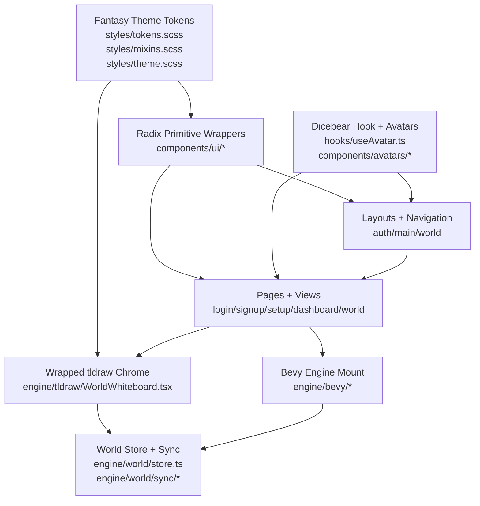
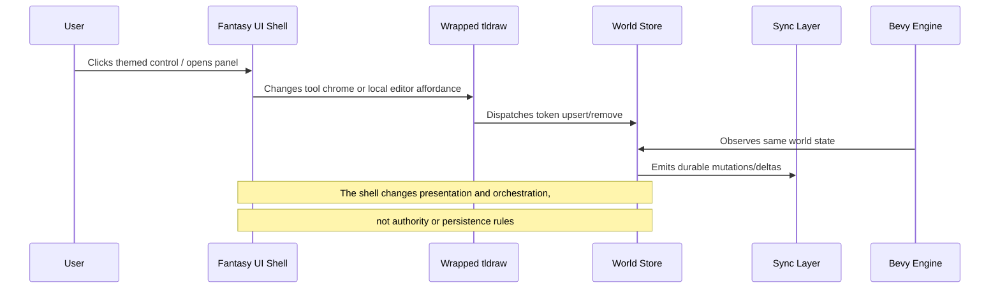

# ADR-004: Fantasy UI Shell with Radix Primitives, Dicebear Identity Surfaces, and Wrapped tldraw Chrome

**Status:** Accepted

**Decision Date:** 2026-05-04

## Context

ThunderForgeVTT's web frontend (`apps/web/src`) needed a full visual overhaul while preserving the existing runtime architecture:

1. **Bevy engine bindings** still mount into the world canvas and own simulation concerns
2. **World sync** still flows through the current `engine/world/store.ts` and sync transport layer
3. **tldraw** still owns whiteboard document editing and canvas behavior
4. **Existing import structure** under `components/`, `layouts/`, `pages/`, `views/`, and `engine/` must remain stable enough for continued iteration

The prior UI layer was intentionally thin, but it lacked:

- A reusable design system for future web surfaces
- Accessible component primitives for dialogs, menus, tabs, tooltips, and overlays
- A coherent visual identity for auth, dashboard, and world views
- A typed avatar/token identity layer for players, NPCs, and scenes
- A safe way to theme the whiteboard without rewriting collaborative behavior

At the same time, the overhaul could not violate the existing architectural boundary established in the application:

- UI shells may **wrap** engine and whiteboard entrypoints
- UI components may **observe** world store state
- UI components must **not** become the source of truth for world state
- The redesign must **not** move network or adjudication logic into React presentation components

## Decision

We have decided to establish a **fantasy-themed frontend shell architecture** for the web app where:

1. **Radix UI primitives** provide the accessibility and interaction foundation for reusable UI components under `apps/web/src/components/ui/`
2. A **shared fantasy design system** in `apps/web/src/styles/` provides tokens, mixins, type, surfaces, motion cues, and thematic visual language
3. **Dicebear-based avatar/token generation** provides deterministic identity surfaces through a dedicated hook and wrapper components, rather than embedding avatar logic directly into pages
4. **tldraw integration remains wrapped, not rewritten**: ThunderForge skins the editor with fantasy chrome, tool affordances, overlays, and surrounding panels while preserving whiteboard/store synchronization behavior
5. **Layouts and pages consume the new component layer** without changing the existing routing and engine integration seams

### Frontend Composition Pattern

### World View Boundary

### Implementation Shape

**Design system** (`apps/web/src/styles/`)

- Shared fantasy palette: parchment, umber, forest, violet, gold, candlelight
- Typography and shell-level global styling
- Surface mixins for parchment, leather, stone, tome bars, glow, and vignette treatments

**Component library** (`apps/web/src/components/ui/`)

- Existing primitives upgraded: `button`, `card`, `field`, `loader`, `status-badge`
- New Radix-based wrappers: `dialog`, `dropdown`, `tabs`, `tooltip`, `scroll-area`, `popover`
- Theme-specific building blocks: `panel`, `rune-divider`, `fantasy-icon`, `avatar`, `token-avatar`

**Identity surfaces** (`apps/web/src/hooks/useAvatar.ts`, `apps/web/src/components/avatars/`)

- Deterministic avatar and token URLs derived from Dicebear seeds
- Export helpers for SVG/PNG handoff to future token workflows
- Page/layout-level consumers remain presentation-only

**Shell and page adoption** (`apps/web/src/layouts/*`, `apps/web/src/pages/*`, `apps/web/src/views/*`)

- Auth, main, and world layouts move to the shared fantasy shell
- Pages consume the new components instead of bespoke local structure
- Legacy `views/*` continue to resolve to the updated pages

**Wrapped tldraw** (`apps/web/src/engine/tldraw/WorldWhiteboard.tsx`)

- The editor is skinned with a fantasy toolbar, parchment frame, rune grid overlay, and minimap panel
- Whiteboard/store synchronization logic stays intact
- The shell can observe tokens for minimap/sidebar context without changing the sync contract

## Rationale (Y-Statement)

> In the context of **scaling ThunderForgeVTT's web surface from a thin utility UI into a richer product shell**, facing **the need for accessible primitives, a distinct visual identity, and future-ready surfaces for worlds, scenes, actors, tokens, and permissions without disturbing engine/sync authority boundaries**, we decided for **a fantasy-themed shell architecture built on Radix wrappers, shared theme tokens, Dicebear identity hooks, and wrapped tldraw chrome**, to achieve **reusability, accessibility, consistent theming, safe UI extensibility, and preservation of existing Bevy/world-sync/tldraw contracts**, accepting **additional frontend structure, styling complexity, and a stronger dependency on a shared component system**, because **this keeps presentation concerns composable while leaving multiplayer state flow and server authority untouched**.

## Consequences

### Positive

1. **Consistent Design Language**: Auth, dashboard, and world views now share the same theme tokens and shell patterns.

2. **Accessible Interaction Baseline**: Radix primitives provide a stronger default foundation for overlays, menus, tabs, and focus handling.

3. **Safer Future Expansion**: Worlds, scenes, tokens, actors, and permissions now have a component and layout system ready for incremental growth.

4. **Deterministic Identity Layer**: Dicebear seeds provide a low-friction path for player avatars, NPC portraits, and token art.

5. **Boundary Preservation**: The world canvas and whiteboard remain wrapped by the UI, not absorbed into it; Bevy and sync logic remain intact.

6. **Import Stability**: The overhaul fits the existing `apps/web/src/*` structure, allowing future work to extend current modules rather than replace them.

### Negative

1. **Heavier Frontend Surface Area**: More components, styles, and shell variants increase maintenance cost.
   - *Mitigation:* Keep the design system centralized in tokens/mixins and continue routing UI changes through shared primitives.

2. **Theme Coupling**: Strong visual identity makes ad hoc one-off components more obviously inconsistent.
   - *Mitigation:* Require new views to compose from `components/ui/*` and theme tokens rather than page-local styling first.

3. **Wrapped tldraw Complexity**: Themed chrome around tldraw adds coordination work whenever editor behavior changes.
   - *Mitigation:* Continue treating `WorldWhiteboard.tsx` as a wrapper layer and avoid deep editor rewrites unless a stable API requires it.

4. **External Identity Dependency**: Dicebear introduces a remote avatar generation dependency.
   - *Mitigation:* Keep generation isolated behind `useAvatar()` so future local rendering/caching strategies can replace it without page churn.

5. **CSS Growth**: A fantasy shell with multiple surface types and effects expands SCSS output and styling complexity.
   - *Mitigation:* Prefer reusable mixins and shared modules; avoid duplicating visual recipes in page-level SCSS.

### Implementation Todos

- [ ] Add world index and world detail metadata panels using the new shell primitives
- [ ] Bind Dicebear token seeds to persisted actor/token records instead of demo-only seeds
- [ ] Expand the world sidebar into scene, actor, and permission management surfaces
- [ ] Decide whether avatar export should remain direct-download or move into a managed asset pipeline
- [ ] Evaluate whether tldraw toolbar actions should remain local wrappers or map to a richer scene-editor command model

## Related Decisions

- [ADR-000: Durable Objects via GraphQL Event-Driven Synchronization Architecture](./20260501-000-durable_objects_with_graphql_event_driven_sync.md)
- **ADR-005** (future): World/scene management information architecture for the fantasy shell
- **ADR-006** (future): Actor sheets, token metadata, and permissions UX model

## References

- [Radix UI](https://www.radix-ui.com/)
- [Dicebear HTTP API](https://www.dicebear.com/)
- [tldraw Documentation](https://tldraw.dev/)
- [Documenting Architecture Decisions](https://cognitect.com/blog/2011/11/15/documenting-architecture-decisions)
