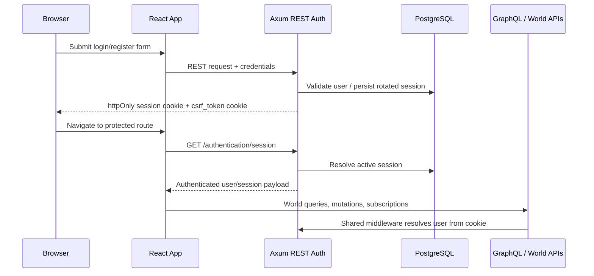

# ADR-005: REST Authentication with Database-Backed Cookie Sessions

**Status:** Accepted

**Decision Date:** 2026-05-04

## Context

ThunderForgeVTT Phase 1 needed a production-ready login and registration flow that fits the existing repository shape across:

1. **Axum auth routes** already mounted under `/authentication/*`
2. **Diesel-backed persistence** with existing `users`, `user_sessions`, and OAuth-related migrations
3. **Cookie middleware and CSRF enforcement** already wired in `src/server/src/auth_middleware.rs`
4. **Frontend auth pages and routing** under `apps/web/src` that now sit inside the fantasy UI shell
5. **Future multiplayer/domain requirements** where user identity must later attach to worlds, actors, permissions, invites, and event logs

The main architectural choice for Phase 1 was whether authentication should be implemented as:

- **GraphQL mutations and queries**, or
- **REST endpoints** layered onto the existing auth router

The decision also needed to settle the session model:

- whether to use browser cookies or client-stored bearer tokens
- whether sessions should be opaque DB records or self-contained JWTs
- how CSRF protection and session rotation should work without breaking the current app structure

## Decision

We have decided to implement Phase 1 authentication as **REST endpoints backed by database-stored opaque sessions in secure cookies**, with **double-submit CSRF protection** and **session rotation on login/refresh**.

### Phase 1 Auth Surface

**Backend**

1. `POST /authentication/register`
2. `POST /authentication/login`
3. `GET /authentication/session`
4. `POST /authentication/session/refresh`
5. `POST /authentication/logout`

**Frontend**

1. `apps/web/src/api/auth.ts` is the single browser auth client
2. `apps/web/src/hooks/useAuth.ts` owns session bootstrap and shared auth state
3. `apps/web/src/routes/AppRoutes.tsx` handles protected routes and auth redirects
4. `LoginPage`, `RegisterPage`, and the legacy signup alias all use the shared auth layer

### Session Strategy



### Server Boundary

```text
Browser UI
  -> REST auth endpoints for login/register/session lifecycle
  -> GraphQL and world APIs only after auth middleware resolves identity

Cookie session
  -> opaque session ID in secure httpOnly cookie
  -> session row persisted in user_sessions
  -> user identity resolved server-side on each request
```

## Rationale (Y-Statement)

> In the context of **adding Phase 1 user authentication to ThunderForgeVTT without disturbing its existing Axum, Diesel, cookie, and OAuth scaffolding**, facing **the need for secure login/register flows, browser-safe session handling, CSRF protection, and a clear path to attach identity to worlds, permissions, actors, and multiplayer auditing**, we decided for **REST authentication endpoints with database-backed opaque sessions stored in secure cookies and rotated over time**, to achieve **tight alignment with the current backend structure, safer browser storage defaults, reuse of existing middleware, and clean integration with future server-authoritative game features**, accepting **an additional REST auth surface beside GraphQL and the operational cost of server-side session persistence**, because **authentication is an HTTP/session concern first in this codebase, while GraphQL should consume authenticated identity rather than own credential exchange**.

## Consequences

### Positive

1. **Fits the Existing Backend**: The auth implementation extends the current Axum router, middleware, and Diesel schema instead of introducing a second auth stack.

2. **Safer Browser Posture**: Opaque session IDs stay in `httpOnly` cookies, avoiding token storage in `localStorage` or other script-accessible stores.

3. **CSRF Has a Natural Home**: Mutating session endpoints can use the existing cookie-aware CSRF middleware and `x-csrf-token` header pattern.

4. **GraphQL Gets Real Identity**: GraphQL resolvers can consume authenticated request data instead of handling credentials directly or relying on placeholder users.

5. **Future Domain Mapping Is Straightforward**: Users can later be joined to world ownership, actor control, invitations, policies, and event attribution using stable user IDs and session-backed identity.

6. **Session Revocation Is Centralized**: Because sessions live in the database, logout and rotation can revoke server-side state without waiting for token expiry.

### Negative

1. **Auth Lives Outside GraphQL**: The app now has both REST auth endpoints and GraphQL application endpoints.

   - _Mitigation:_ Keep auth lifecycle calls isolated in `apps/web/src/api/auth.ts` and treat GraphQL as an authenticated application surface, not a credential surface.

2. **Server-Side Session Storage Adds DB Work**: Each authenticated request depends on session lookup and validation.

   - _Mitigation:_ Keep the session table narrow, index session IDs, and continue revoking/reissuing sessions in a controlled way.

3. **Cookie-Based Auth Requires CSRF Discipline**: Session mutations must consistently send the CSRF header when a session cookie exists.

   - _Mitigation:_ Centralize CSRF header injection in the frontend auth client and keep middleware enforcement at the server boundary.

4. **Single-Session Rotation Is Opinionated**: Rotating and revoking active sessions on login reduces replay risk but may sign users out from other devices.

   - _Mitigation:_ Revisit multi-device session policy in a later ADR when invite flows, device trust, and account management UX are implemented.

5. **OAuth Still Needs Phase 2 Hardening**: OAuth tables and flows exist, but Phase 1 focuses on email/password plus session lifecycle.

   - _Mitigation:_ Reuse the same session issuance and user-resolution path for OAuth completion flows rather than introducing a separate model.

### Implementation Notes

- Passwords are hashed with Argon2.
- Session rows are stored in `user_sessions`.
- `resolve_authenticated_user(...)` is the shared middleware helper for HTTP and GraphQL request auth.
- `GET /authentication/session` is the bootstrap source of truth for frontend auth state.
- `POST /authentication/session/refresh` reissues the DB-backed cookie session.

## Related Decisions

- [ADR-000: Durable Objects via GraphQL Event-Driven Synchronization Architecture](./20260501-000-durable_objects_with_graphql_event_driven_sync.md)
- [ADR-004: Fantasy UI Shell with Radix Primitives, Dicebear Identity Surfaces, and Wrapped tldraw Chrome](./20260504-000-fantasy_ui_shell_with_radix_and_wrapped_tldraw.md)
- **Future ADR:** Multi-device session policy, invite flows, and permission-aware account management

## References

- [OWASP Session Management Cheat Sheet](https://cheatsheetseries.owasp.org/cheatsheets/Session_Management_Cheat_Sheet.html)
- [OWASP Cross-Site Request Forgery Prevention Cheat Sheet](https://cheatsheetseries.owasp.org/cheatsheets/Cross-Site_Request_Forgery_Prevention_Cheat_Sheet.html)
- [Axum](https://github.com/tokio-rs/axum)
- [Diesel](https://diesel.rs/)
- [Documenting Architecture Decisions](https://cognitect.com/blog/2011/11/15/documenting-architecture-decisions)
